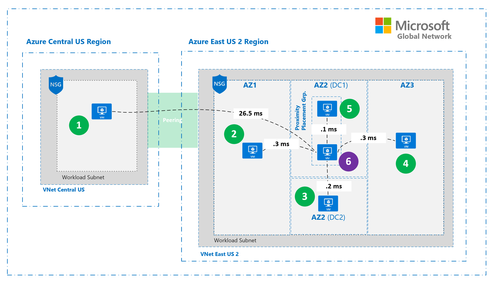

# Proximity Placement Groups - Lab Environment

Network latency is an important factor to consider when mapping out your solution architecture in the cloud. The ARM templates and scripts in this repository have been designed to help you get hands on with some of the techniques that will allow you to influence this aspect of performance in Azure.

Specifically, we'll focus on a feature that recently (Dec 2019) became generally available called ["Proximity Placement Groups"](https://docs.microsoft.com/en-us/azure/virtual-machines/windows/co-location#proximity-placement-groups).

## What You'll Deploy

Before you get started, take a look at the writeup on proximity placement groups [out on Azure Docs](https://docs.microsoft.com/en-us/azure/virtual-machines/windows/co-location#proximity-placement-groups). It's a short read and will give you the context you need to understand the environment and testing described below. Make sure you pay special attention to the notes on best practices!

You'll deploy two stand-alone virtual machines in a proximity placement group and configure both VM's with accelerated networking for the lowest possible latency. You'll also deploy a number of  virtual machines in different regions and availability zones to illustrate the relative network performance differences when compared to those within the proximity placement group.

The diagram below shows the final deployed environment when all scripts have successfully run.

I've also included example latencies from my own [testing](#Testing) to give you a feel for the magnitude of differences in latency between different VMs. I was seeing around .1 ms for VMs within the proximity group. That's pretty quick!

## Step by Step


### Prerequisites
- The scripts in this repo were built / tested on Linux (Ubuntu to be specific).
- Make sure that you have the Azure CLI installed and authenticated. Also make sure you have the right subscription selected.
- You'll need permissions to create and manage network and VM resources.

### Setting up your Parameters
params.sh is sourced from all other scripts. Parameters in this file are passed to the ARM templates in the Network, ProximityVM and StandaloneVM directories on deployment.

- rename params.sh.example to params.sh
- substitute in your values for:
    - sourceIp
    - userName
    - sshKey
- save the file!

### Running the Scripts
#### [00-deployNetworks.sh](00-deployNetworks.sh)
This script will call an ARM template that deploys two peered VNets; one in Central US and one in East US 2.

Each VNet has a single subnet in it that we'll use to deploy test machines. 

The template also deploys two NSGs that are used to allow SSH access only from the block you provided in the parameters file.

```
./00-deployNetworks.sh
```
#### [01-deployVMCentralUsAz1.sh](01-deployVMCentralUsAz1.sh)
This script will deploy the first test machine (Ubuntu). This machine will be deployed to the **Central US** VNet in **availability Zone 1**.

```
./01-deployVMCentralUsAz1.sh
```
#### [02-deployVMEastUs2Az1.sh](02-deployVMEastUs2Az1.sh)
This script will deploy the second test machine (Ubuntu). This machine will be deployed to the **East US 2** VNet in **availability Zone 1**.

```
./02-deployVMEastUs2Az1.sh
```
#### [03-deployVMEastUs2Az2.sh](03-deployVMEastUs2Az2.sh)
This script will deploy the third test machine (Ubuntu). This machine will be deployed to the **East US 2** VNet in **availability Zone 2**.
```
./03-deployVMEastUs2Az2.sh
```
#### [04-deployVMEastUs2Az3.sh](04-deployVMEastUs2Az3.sh)
This script will deploy the fourth test machine (Ubuntu). This machine will be deployed to the **East US 2** VNet in **availability Zone 3**.

```
./04-deployVMEastUs2Az3.sh
```
#### [05-06-deployProximityVMsEastUs2Az2.sh](05-06-deployProximityVMsEastUs2Az2.sh)
The final script will deploy two virtual machines into the **East US 2** VNet. These VMs will be placed into a proximity placement group in **availability zone 2** and will be configured with [accelerated networking](https://docs.microsoft.com/en-us/azure/virtual-network/create-vm-accelerated-networking-cli).

```
./05-06-deployProximityVMsEastUs2Az2.sh
```
## Testing
Microsoft has posted some [great guidance](https://docs.microsoft.com/en-us/azure/virtual-network/virtual-network-test-latency#for-ubuntu) on latency testing of Azure VM's. For my testing I pretty much followed the guidance verbatim. Again, I'll spare you from reproducing those docs here. Make sure to go read them however!

After deployment you should be able to SSH into each test VM.

From there it should be simple to download, build and install sockperf on each machine.

Test latency between whatever machines you wish to test. In my case I started sockperf up as a receiver on VM6 and ran tests from all other VMs in the environment. You can see those latencies shown in the [diagram above](#Step-by-Step).

Have fun!